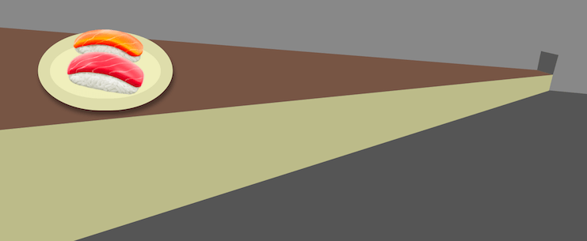

# 🍣 Kaiten Sushi 🍣 - Approaches to Web animations



This is the repository for [this tutorial](https://dev.to/lucamug/kaiten-sushi-approaches-to-web-animations-306k)

In the tutorial we analyze several technics to implement the same animation in a web page.

1. CSS Transition                - [Demo](https://lucamug.github.io/kaiten-sushi/tutorial-01-css-transition.html)
2. CSS Animation                 - [Demo](https://lucamug.github.io/kaiten-sushi/tutorial-02-css-animation.html)
3. Vanilla Javascript Animation  - [Demo](https://lucamug.github.io/kaiten-sushi/tutorial-03-vanilla-javascript.html)
4. Vanilla Elm Animation         - [Demo](https://lucamug.github.io/kaiten-sushi/tutorial-04-vanilla-elm.html)
5. elm-animator Inline Animation - [Demo](https://lucamug.github.io/kaiten-sushi/tutorial-05-elm-animator-inline-1.html)


# How to play with these example

```
$ npm install
```

This will install `elm`, `elm-live` and `terser`.


# Example 04 - Vanilla Elm

```
$ cmd/start-vanilla-elm
```

* Edit the source code at `src/Tutorial_04_VanillaElm.elm`
* Verify the changes at http://localhost:8000/tutorial-04-vanilla-elm.html

# Example 05 - elm-animator Inline

```
$ start-elm-animator-inline1
```

* Edit the source code at `src/Tutorial_05_ElmAnimatorInline1.elm`
* Verify the changes at http://localhost:8000/tutorial-05-elm-animator-inline-1.html

# Others Examples

All other examples are available while `elm-live` is running:

* http://localhost:8000/tutorial-01-css-transition.html
* http://localhost:8000/tutorial-02-css-animation.html
* http://localhost:8000/tutorial-03-vanilla-javascript.html

And can be edited directly from the folder `docs`
